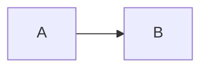
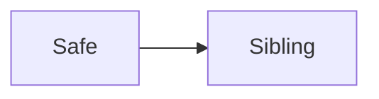

# Before 0

Readable before


```mermaid
flowchart LR
A-->B
```

# After 0

Readable after


```mermaid
flowchart LR
Safe-->Sibling
```

```javascript
window.__hostileExecuted=true; fetch("https://127.0.0.1:9/code")
```

<script>window.__hostileExecuted=true</script>


